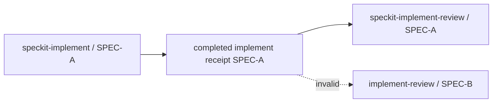

# SpecKit PowerPack

> **Status: Draft / pre-release.** The project is evolving toward its first stable public release. The current supported AI execution hosts are intentionally limited to **Claude Code** and **GPT/Codex**.

SpecKit PowerPack is a composable enhancement layer for the official [GitHub Spec Kit](https://github.com/github/spec-kit). It does **not** fork or replace Spec Kit. It adds workflow state, convergence, deep implementation review, technical-debt governance, model routing, resumable full-cycle orchestration and optional ChatGPT Project context for a second review perspective.

## Supported hosts in this pre-release

| Host / interface | Status | PowerPack integration |
|---|---|---|
| Claude Code CLI | **Supported** | `claude` |
| Codex CLI | **Supported** | `codex` |
| ChatGPT Desktop using a Codex local workspace/session | **Supported as Codex host** | `codex` |
| Claude Desktop | Not supported yet | — |
| GitHub Copilot / Copilot CLI | Not supported yet | — |
| Gemini, Grok, AGY and other agent CLIs | Not supported yet | — |

There is no separate `chatgpt-desktop` integration identifier. When ChatGPT Desktop is operating the same local repository through Codex, configure the repository with `--integration codex`.

Claude Desktop is intentionally excluded for now. Use **Claude Code** for the Anthropic execution path.

## Current workflow

```text
speckit-specify
  -> speckit-clarify
  -> speckit-plan
  -> speckit-checklist
  -> speckit-checklist-converge
  -> speckit-tasks
  -> speckit-analyze
  -> speckit-implement
  -> speckit-implement-review
       -> convergence
       -> independent semantic review
       -> optional ChatGPT Project-aware review when the repository is bound
       -> corrective implementation + fresh reviews until convergence
```

The first `speckit-implement` is explicit and mandatory. `speckit-implement-review` must not manufacture or skip that predecessor.

## Review context model

PowerPack separates three concepts:

```text
Authentication
  -> Codex/ChatGPT account from ~/.codex/auth.json

Repository binding
  -> local repository optionally linked to one ChatGPT Project (g-p-...)

Review execution
  -> current branch + current SPEC + current open PR
     plus ChatGPT Project context when a binding exists
```

A ChatGPT Project binding is **optional**.

When there is no Project binding, the review must explicitly operate with the local repository/current branch/current SPEC context and must not claim that ChatGPT Web/Project memory was used.

When there is a Project binding, PowerPack can additionally load Project metadata, instructions and relevant Project conversation context through `chatgpt.com/backend-api` using the Codex-authenticated account. No Playwright or browser is required for this provider.

## Code-review quality invariants

A real implementation code review is not a generic repository review. Before a final review gate is accepted, PowerPack is expected to bind the review to all of the following:

- current Git branch;
- current Spec Kit SPEC and its artifacts;
- an **open GitHub pull request whose head branch is the current branch**;
- base ref/base SHA, merge-base and current head SHA;
- complete changed-file snapshot/diff;
- current quality-gate evidence;
- ChatGPT Project context only when the repository has an explicit Project binding.

If there is no open PR corresponding to the current branch/SPEC, the final PR code-review flow must fail closed instead of producing a low-context approval.

A Project-context smoke test is only a transport/context test. It does **not** prove that a PR is ready or that a real code review has converged.

## Session-aware Codex rule

When a PowerPack skill is already running **inside an existing Codex or ChatGPT Desktop/Codex session**, it must remain inside that session and must not recursively launch another `codex` CLI process merely to perform the review.

```text
Already inside Codex / ChatGPT Desktop Codex session
  -> keep current session
  -> use current reviewer context or one in-session reviewer/subagent when required
  -> never recursively spawn codex exec for the same review

Running from Claude Code
  -> one external Codex reviewer may be started when the workflow requires an independent Codex review
```

This prevents split context, duplicated sessions and self-review behavior caused by nested Codex processes.

## Requirements

Common requirements:

- Python 3.11+
- Git
- `uv`
- official Spec Kit `>=1.0.0` (PowerPack can bootstrap/upgrade to tested `v1.0.4`)
- Claude Code and/or Codex CLI according to the selected integration

For ChatGPT Project discovery/review:

- Codex must be authenticated in the **same operating-system environment** where PowerPack is running;
- PowerPack reuses `~/.codex/auth.json` (Linux/WSL) or `$HOME\.codex\auth.json` (Windows PowerShell);
- no Playwright, Chromium or browser installation is required.

## Install the PowerPack CLI

The browserless ChatGPT Project provider is currently being validated on:

```text
feat/chatgpt-project-provider-no-browser
```

Use `main` after this work is merged/released. For the current preview, install the feature branch explicitly.

### Linux / WSL

```bash
uv tool install --force \
  'git+https://github.com/ds1david/speckit-powerpack.git@feat/chatgpt-project-provider-no-browser'

which speckit-powerpack
speckit-powerpack --version
```

Expected executable location is normally under `~/.local/bin`.

### Windows PowerShell

```powershell
uv tool install --force `
  "git+https://github.com/ds1david/speckit-powerpack.git@feat/chatgpt-project-provider-no-browser"

Get-Command speckit-powerpack
speckit-powerpack --version
```

Use either native Windows **or** WSL as the execution environment for a repository. Do not mix the two during one active PowerPack run unless you intentionally want separate global config/auth namespaces.

## Configure an existing Spec Kit repository

Run the following commands from the repository root.

### Claude Code — Linux / WSL

```bash
git status --short
git branch --show-current

speckit-powerpack install . \
  --integration claude \
  --bootstrap-speckit \
  --no-update-check

speckit-powerpack doctor .
claude
```

PowerPack skills are then executed from the Claude Code session attached to that same repository.

If you also want ChatGPT Project-aware review while Claude Code is the main implementer, Codex must still be logged in because the Project provider reuses Codex authentication:

```bash
codex --version
test -f ~/.codex/auth.json && echo "Codex auth OK"
speckit-powerpack review auth authorize codex
```

### Claude Code — Windows PowerShell

```powershell
git status --short
git branch --show-current

speckit-powerpack install . `
  --integration claude `
  --bootstrap-speckit `
  --no-update-check

speckit-powerpack doctor .
claude
```

For Project-aware review:

```powershell
codex --version
Test-Path "$HOME\.codex\auth.json"
speckit-powerpack review auth authorize codex
```

### Codex CLI — Linux / WSL

```bash
git status --short
git branch --show-current

codex --version
test -f ~/.codex/auth.json && echo "Codex auth OK"

speckit-powerpack install . \
  --integration codex \
  --bootstrap-speckit \
  --no-update-check

speckit-powerpack doctor .
codex
```

Once inside Codex, PowerPack skills should stay in that same Codex session. Do not launch another nested Codex session for the review path.

### Codex CLI — Windows PowerShell

```powershell
git status --short
git branch --show-current

codex --version
Test-Path "$HOME\.codex\auth.json"

speckit-powerpack install . `
  --integration codex `
  --bootstrap-speckit `
  --no-update-check

speckit-powerpack doctor .
codex
```

### ChatGPT Desktop

ChatGPT Desktop is supported only when it is acting as a **Codex host for the same local repository**. There is no separate PowerPack integration.

Prepare the repository first from its terminal environment:

```bash
speckit-powerpack install . --integration codex --bootstrap-speckit --no-update-check
speckit-powerpack doctor .
```

Then open/use the same repository in the ChatGPT Desktop Codex workspace/session. Session-aware rules are the same as Codex CLI: do not recursively spawn another Codex session for code review.

## Codex/ChatGPT account authorization

PowerPack does not copy browser cookies or ask for a second browser login. It reads the account already authenticated by Codex.

### Linux / WSL

```bash
codex --version
test -f ~/.codex/auth.json && echo "Codex auth encontrado"
speckit-powerpack review auth authorize codex
speckit-powerpack review auth list
```

### Windows PowerShell

```powershell
codex --version
Test-Path "$HOME\.codex\auth.json"
speckit-powerpack review auth authorize codex
speckit-powerpack review auth list
```

The authorization probe validates actual ChatGPT/Codex backend access; the PowerPack must not treat mere file existence as sufficient proof of readiness.

## Optional ChatGPT Project binding

### Interactive setup

```bash
speckit-powerpack review setup --path .
```

The CLI asks whether the current repository should be linked to a ChatGPT Project.

If you answer **no**, the expected state is:

```text
Provider: codex
ChatGPT Project: not linked
Review context: current branch + current SPEC + open PR/local repository evidence
ChatGPT Project memory: not used
```

The non-interactive equivalent is:

```bash
speckit-powerpack review setup --path . --no-project
```

If you answer **yes**, the CLI discovers accessible Projects and presents a numbered terminal selection list.

### Discover Projects

```bash
speckit-powerpack review project discover
```

Example:

```text
 1. project-a | g-p-... | https://chatgpt.com/g/g-p-.../project
 2. project-b | g-p-... | https://chatgpt.com/g/g-p-.../project
```

Then either run interactive setup:

```bash
speckit-powerpack review setup --path .
```

or bind a known Project by name/id/URL:

```bash
speckit-powerpack review setup \
  --path . \
  --yes-project \
  --project 'g-p-...'
```

### Import a known/shared Project URL

If the currently authenticated Codex account already has access to a Project owned by another account, bind the canonical Project URL directly:

```bash
speckit-powerpack review project add \
  'https://chatgpt.com/g/g-p-.../project' \
  --alias my-project \
  --path .
```

The Project owner does **not** need to be the owner of the current Codex account. What matters is that the current authenticated account has access to that Project.

Current browserless limitation: if you only have a generic invite/share URL that has not yet been accepted by the current account, PowerPack cannot click/accept that permission flow. Accept the share once in ChatGPT using the desired account, then bind the resulting canonical `g-p-*` Project URL.

### Leave the repository unbound

A user must always be able to leave setup without choosing a Project:

```bash
speckit-powerpack review setup --path . --no-project
```

Unbinding Project context must not log the Codex account out and must not make local/Codex review unavailable.

## Validate Project context

First verify discovery/binding:

```bash
speckit-powerpack doctor --strict-review .
```

Current browserless readiness checks include:

```text
OK specify
OK spec-kit-project
OK powerpack-runtime
OK selected-executor
OK codex-auth-json
OK review-provider-configured
OK chatgpt-project-binding
```

Then run the Project-context smoke test:

```bash
speckit-powerpack review smoke --flow web --path .
```

The Web/Project smoke intentionally asks a simple context question and prints the complete answer so a human can verify that the selected Project context really reached the model.

It does **not** create a visible ChatGPT conversation and it does **not** approve a PR.

CLI transport smoke:

```bash
speckit-powerpack review smoke --flow cli --path .
```

Both:

```bash
speckit-powerpack review smoke --flow both --path .
```

## Before a real implementation review

From the repository root, inspect at least:

```bash
git status
git branch --show-current
git rev-parse HEAD
```

On Linux/WSL, Spec Kit can normally resolve the current feature with:

```bash
bash .specify/scripts/bash/check-prerequisites.sh --json
```

On Windows PowerShell:

```powershell
powershell -NoProfile -ExecutionPolicy Bypass `
  -File .specify\scripts\powershell\check-prerequisites.ps1 `
  -Json
```

When GitHub CLI is installed, verify the PR tied to the current branch:

```bash
gh pr view --json number,state,isDraft,headRefName,baseRefName,url
```

A final review should not proceed when there is no open PR whose `headRefName` matches the current branch.

## Expected review configuration

### Repository without ChatGPT Project

```json
{
  "provider": "codex",
  "chatgpt_web": {
    "required": false,
    "enabled": false,
    "mode": "disabled"
  }
}
```

### Repository bound to ChatGPT Project

```json
{
  "provider": "chatgpt-project",
  "chatgpt_web": {
    "required": true,
    "enabled": true,
    "mode": "backend-api",
    "project_id": "g-p-...",
    "project_name": "Example Project",
    "project_url": "https://chatgpt.com/g/g-p-.../project",
    "profile": "codex",
    "authorization": "codex-backend-api"
  }
}
```

## Installed project layout

```text
.specify/
└── powerpack/
    ├── bin/
    │   ├── powerpack.py
    │   ├── capabilities.py
    │   ├── review_protocol.py
    │   ├── debt.py
    │   └── full_cycle.py
    ├── model-routing.json
    ├── prerequisites.json
    ├── quality-gates.json
    ├── review.json
    ├── full-cycle.json
    ├── technical-debt.json
    ├── update.json
    ├── deep-review-protocol.md
    ├── state/
    └── runtime/
```

Authentication material remains outside the repository. Raw Codex tokens from `~/.codex/auth.json` must never be logged, copied into review prompts or committed.

## Same-SPEC workflow safety

PowerPack does not treat artifact existence as proof that a predecessor actually ran.



Review approval is valid only for the exact current snapshot. Any implementation change invalidates the earlier approval and requires fresh convergence/review evidence.

Findings cannot be converted to debt/backlog/TODO merely to force convergence.

## Capability-driven quality gates

PowerPack does not hard-code one universal Maven/Gradle/npm/pytest command. `.specify/powerpack/bin/capabilities.py` discovers a reproducible strategy and fails closed on unknown/ambiguous architecture. Documentation-only implementation deltas may be `NOT_APPLICABLE`.

## Full cycle

```text
clarify
→ plan
→ checklist/checklist-converge
→ tasks
→ analyze
→ implement
→ implement-review
→ DONE
```

`implement-review` owns its internal convergence and corrective review loop.

## Updates and recovery

```bash
speckit-powerpack update . --check
speckit-powerpack update .
speckit-powerpack update . --yes
```

Project-only rematerialization:

```bash
speckit-powerpack update . --project-only --force --yes
```

Reset mutable PowerPack configuration only after explicit approval:

```bash
speckit-powerpack update . --project-only --force --reset-config --yes
```

PowerPack does not authorize merge, GitHub approval, ready-for-review changes, force-push or destructive reset unless a separate explicit user instruction authorizes that action.

## Security boundaries

- never commit or print the contents of `~/.codex/auth.json`;
- no Playwright/Chromium/browser dependency is required by the browserless Project provider;
- Project discovery and context access use the account already authenticated by Codex;
- a Project binding never changes the current Codex login silently;
- a shared Project may belong to another account as long as the current Codex-authenticated account has access;
- nested/recursive Codex CLI spawning is forbidden when already inside a Codex/ChatGPT Desktop Codex session;
- code review must remain bound to the current branch, current SPEC, current open PR and immutable snapshot evidence;
- technical debt cannot hide active review findings or failed mandatory gates.

## Documentation

Some older documents in this pre-release may still describe the previous browser/Playwright prototype. The browserless provider and this README are the authoritative installation/onboarding reference for `feat/chatgpt-project-provider-no-browser` while those documents are migrated.

Relevant design documents:

- [`docs/CUSTOMIZATION.md`](docs/CUSTOMIZATION.md)
- [`docs/PROCESS_ARCHITECTURE.md`](docs/PROCESS_ARCHITECTURE.md)
- [`docs/IMPLEMENT_REVIEW.md`](docs/IMPLEMENT_REVIEW.md)
- [`docs/FULL_CYCLE.md`](docs/FULL_CYCLE.md)
- [`docs/TECHNICAL_DEBT.md`](docs/TECHNICAL_DEBT.md)
- [`docs/UPDATES.md`](docs/UPDATES.md)
- [`docs/PORTABILITY.md`](docs/PORTABILITY.md)

## License

MIT. See [LICENSE](LICENSE).
